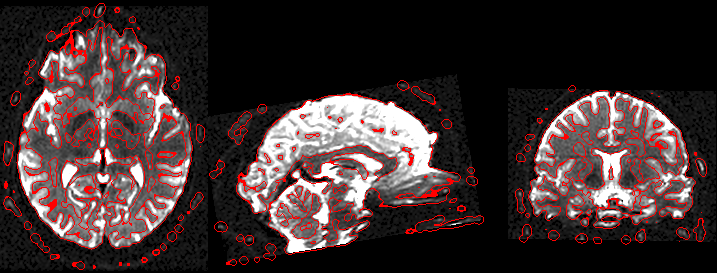

## About

This repository provides a Matlab/SPM implementation for finding edges in a NIfTI image using the the [Marr–Hildreth algorithm](https://en.wikipedia.org/wiki/Marr–Hildreth_algorithm). They noted that the [Difference of Gaussian](https://en.wikipedia.org/wiki/Difference_of_Gaussians) (DoG) approximates the second derivate of Gaussian (the [Laplacian of Gaussian](https://en.wikipedia.org/wiki/Blob_detection#The_Laplacian_of_Gaussian) (LoG)). The method is illustrated below. The raw image (top) is blurred with two Gaussians (here with a 2.0 and 3.2mm [FWHM](https://en.wikipedia.org/wiki/Full_width_at_half_maximum) (middle), the edges are defined as the zero-crossing of this image (bottom).



The [Canny Edge Detector](https://en.wikipedia.org/wiki/Canny_edge_detector) is superior for many 2D applications. However, DoG has several appealing characteristics for 3D medical imaging. First, the Canny method requires image brightness thresholds that are hard to define for MRI modalities where image brightness is relative. Second, the Canny edge tracking by hysteresis is difficult for 3D images (and therefore not implemented by popular tools). In contrast, the DoG uses a spatial threshold, and the size of features in the human brain are known and relatively constant. Furthermore, optimized Gaussian blurs are implemented in most neuroimaging pipelines, making the DoG edge detection simple to compute.

## Usage

Here are some examples of how you could run this from the Matlab command line:

```
spmDoG('DWI.nii.gz') %use default FWHM and dehaze
spmDoG('DWI.nii.gz', 2, 0) %2mm FWHM, no dehaze
spmDoG; %use GUI
spmDoG(strvcat('fMRI.nii','T1.nii'));
```

## Implementation and Dependencies

 - [SPM](https://www.fil.ion.ucl.ac.uk/spm/software/) is used to read and write the NIfTI images, and apply the Gaussian blurs.
 - Damien Garcia [Multi-Otsu Thresholding](https://www.mathworks.com/matlabcentral/fileexchange/26532-image-segmentation-using-otsu-thresholding) is used to remove haze (zero uninteresting voxels). Alternatively, Matlab users with the Image Processing Toolbox could use [multithresh](https://www.mathworks.com/help/images/ref/multithresh.html)
 - Grigori Yourganov wrote the the Euclidean distance transform used to create an edge map of voxels that are at a [zero-crossing](https://homepages.inf.ed.ac.uk/rbf/HIPR2/zeros.htm). Alternatively, Matlab users with the Image Processing Toolbox could use [bwdist](https://www.mathworks.com/help/images/ref/bwdist.html) is used for Gaussian blur.

## Alternatives

 - [PyDog](https://github.com/neurolabusc/PyDog) provides a similar solution in Python.
 - [niimath](https://github.com/rordenlab/niimath) is a high-performance native code implementation.

## Links

 - [Additional sample images](https://github.com/neurolabusc/DoG)
